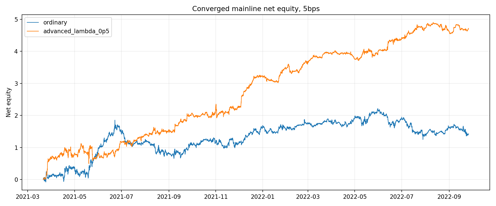
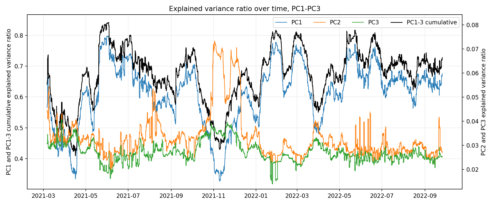
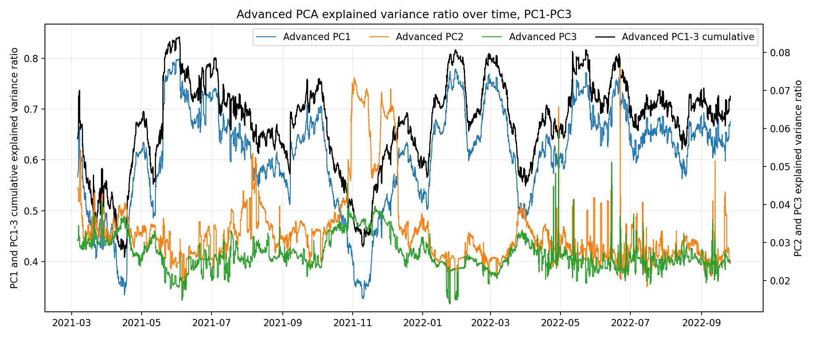
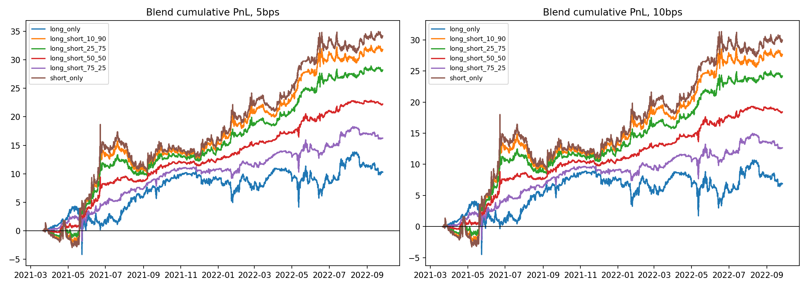

# Crypto PCA Residual Statistical Arbitrage

## Overview

This project builds an hourly crypto statistical arbitrage research pipeline based on PCA residual mean reversion. The main question is whether residuals from ordinary PCA are clean enough for OU-style mean-reversion trading, and whether a residual-comovement-penalized PCA model can improve residual quality and trading performance.

## Research Pipeline

- Build a no-lookahead rolling crypto universe.
- Estimate rolling market-wide factors using W360 / PC3 PCA.
- Regress each token's return on PCA factor returns.
- Convert residual returns into a residual level process.
- Fit an OU / AR(1) model and compute residual s-scores.
- Generate long/short mean-reversion signals.
- Construct matched-sleeve dollar-neutral portfolios and compare ordinary PCA against advanced PCA.

Ordinary PCA focuses on explained variance. Advanced PCA adds a residual-comovement penalty. The goal is cleaner residuals for statistical arbitrage, not only better factor explanation.

## Converged Mainline

- Data: hourly crypto close data.
- PCA window: W360.
- PCA factors: PC1-PC3.
- Execution assumption: same-close execution.
- OU filter: finite price / return / s-score and `0 < half_life <= 90h`.
- Ordinary baseline: ordinary PCA + equal-weight dollar-neutral sleeves.
- Advanced PCA: residual-comovement-penalized PCA with `lambda_pca_comovement = 0.5`.
- Portfolio optimizer: soft factor exposure penalty with `lambda_portfolio_zbeta = 3.0`.
- Universe rule in converged mainline: force exit when a ticker leaves the no-lookahead universe.
- Main reporting fee: 5bps; 0bps and 10bps also reported.

## Main Result

| Model | Fee | Final net equity | Max drawdown | Sharpe-like |
|---|---:|---:|---:|---:|
| Ordinary PCA equal-weight | 5bps | 1.4295 | -1.1939 | 0.7970 |
| Advanced PCA + optimizer | 5bps | 4.7158 | -0.6293 | 2.9666 |

The advanced PCA mainline improves cumulative net equity, reduces drawdown, and materially improves the Sharpe-like metric under the same audited research engine.

Final net equity is reported as cumulative strategy PnL/equity under the research backtest engine, not an annualized return.

## Visual Highlights

### Converged Mainline Performance

The final comparison uses the same audited engine for ordinary PCA and advanced PCA. Advanced PCA improves net equity while reducing drawdown.



### Ordinary PCA Factor Structure

The ordinary PCA diagnostics show that PC1 dominates the crypto cross-section, while PC2 and PC3 are much smaller but still retained for residual construction.



### Advanced PCA Diagnostics

Advanced PCA keeps the W360 / PC3 structure but changes the factor basis by penalizing residual comovement, targeting cleaner mean-reversion residuals.



### Signal Layer Check

The naive 1-dollar layer verifies that the residual s-score signal has directional content before portfolio construction and exposure control.



## Key Validation

- No-lookahead PCA window construction.
- Position-level PnL reconciliation.
- Fee reconciliation for 0bps / 5bps / 10bps.
- Short-sign validation under standard dollar short accounting.
- Gross exposure checks.
- No same-timestamp exit-and-reentry checks.
- Universe dropout / missing-signal diagnostics.
- OU instability diagnostics, especially AR(1) cases where `b >= 1`.
- Residual-comovement diagnostics for ordinary vs advanced PCA.

## Repository Structure

```text
scripts/final_pipeline/                  Final runnable research pipeline
data/processed/final_pipeline/           Materialized mainline intermediates
reports/final_report/                    Final reports and retained diagnostics
reports/final_report/converged_mainline/ Converged mainline outputs
reports/final_report/mainline_narrative.md Cleaned research story
reports/final_report/final_report.md     Full technical report
```

## Run

```bash
python scripts/final_pipeline/run_final_pipeline.py
```

The pipeline uses materialized mainline intermediates under `data/processed/final_pipeline`.

## Reports

- GitHub landing page: `README.md`
- Cleaned research story: `reports/final_report/mainline_narrative.md`
- Full technical report: `reports/final_report/final_report.md`
- Converged mainline report: `reports/final_report/converged_mainline/converged_mainline_report.md`

## Caveats

This is a research backtest, not a production trading system.

- The pipeline uses hourly close data.
- Same-close execution is optimistic.
- Bid-ask spread, order book depth, slippage, market impact, borrow, funding, and live execution latency are not fully modeled.
- Results should be interpreted as research evidence rather than deployable performance.
- Walk-forward / out-of-sample validation remains future work.
