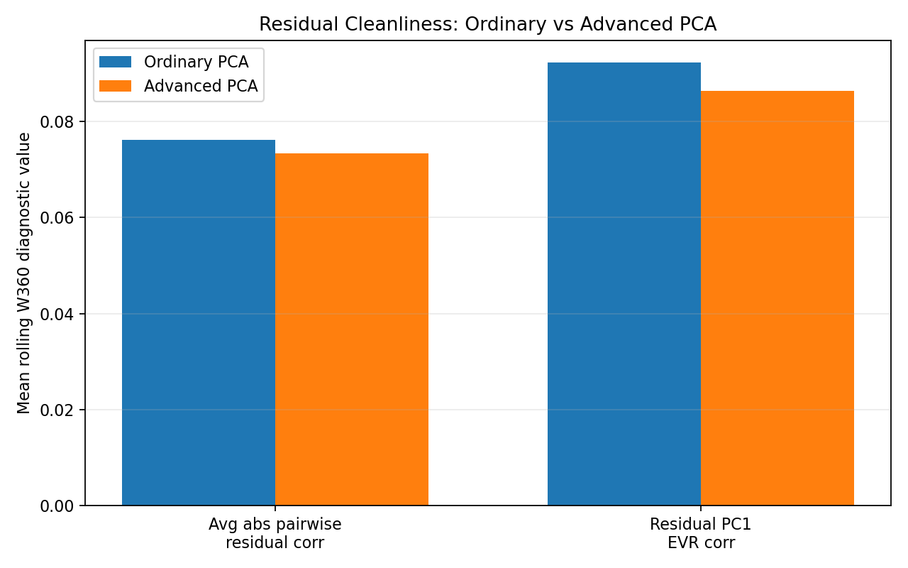
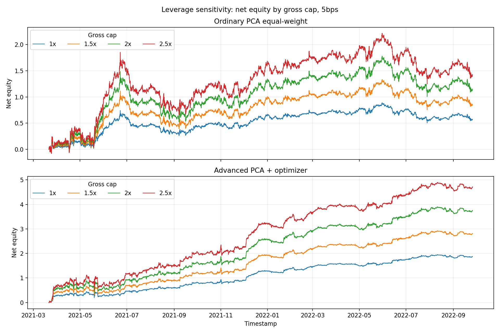
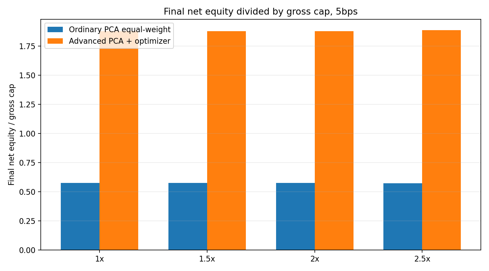

# Crypto PCA Residual Statistical Arbitrage

## Overview

This project builds an hourly crypto statistical arbitrage research pipeline based on PCA residual mean reversion. The main question is whether residuals from ordinary PCA are clean enough for OU-style mean-reversion trading, and whether a residual-comovement-penalized PCA model can improve residual quality and trading performance.

## Research Pipeline

- Build a no-lookahead rolling crypto universe.
- Estimate rolling market-wide factors using W360 / PC3 PCA.
- Regress each token's return on PCA factor returns.
- Convert residual returns into a residual level process.
- Fit an OU / AR(1) model and compute residual s-scores.
- Generate long/short mean-reversion signals.
- Construct matched-sleeve dollar-neutral portfolios and compare ordinary PCA against advanced PCA.

Ordinary PCA focuses on explained variance. Advanced PCA adds a residual-comovement penalty. The goal is cleaner residuals for statistical arbitrage, not only better factor explanation.

## Research Highlights

### Residual-comovement-penalized PCA

Ordinary PCA selects factors by maximizing explained variance, but statistical arbitrage cares about the quality of the remaining residuals. This project introduces an advanced PCA variant that penalizes residual comovement, targeting residuals with lower pairwise correlation and lower residual PC1 explained variance.

The advanced PCA objective searches for three orthonormal factors inside the ordinary PCA candidate subspace:

```text
min_Q reconstruction_loss(Y, Q)
    + lambda_pca_comovement * residual_PC1_EVR_corr(Y - Y Q Q')

subject to Q'Q = I
```

where `Y` is the rolling W360 standardized return matrix, `Q` is the selected PC1-PC3 factor basis, and `residual_PC1_EVR_corr` is the first explained-variance ratio of the residual correlation matrix.

The goal is not only to explain the crypto return cross-section, but to construct residuals that are cleaner for OU-style mean-reversion trading. Compared with ordinary PCA, the advanced PCA reduces average absolute residual pairwise correlation by `3.7%` and residual PC1 EVR by `6.4%` in the retained W360 diagnostic.

The exact residual-cleanliness diagnostics are reported under `reports/final_report/residual_cleanliness/`.

### Equal-weight-prior factor-neutral optimizer

The portfolio optimizer starts from an equal-weight dollar-neutral sleeve as a robust prior, then applies a soft z-factor exposure penalty to reduce residual factor imbalance:

```text
min_w ||w - w_equal||_2^2 + lambda_portfolio_zbeta * z_beta_exposure(w)^2

subject to sum(w_long) = sum(w_short)
           sum(|w|) <= gross_cap capacity
           w_long >= 0, w_short >= 0
```

The equal-weight prior keeps sizing stable, while the soft penalty avoids the infeasibility and overconstraint risk of a hard factor-neutral rule. Long and short notional remain dollar-neutral at sleeve entry; the optimizer mainly improves factor exposure balance when signal breadth allows it. The displayed mainline uses `lambda_portfolio_zbeta = 3.0` and `gross_cap = 1.5`.

## Converged Mainline

- Data: hourly crypto close data.
- PCA window: W360.
- PCA factors: PC1-PC3.
- Execution assumption: same-close execution.
- OU filter: finite price / return / s-score and `0 < half_life <= 90h`.
- Ordinary baseline: ordinary PCA + equal-weight dollar-neutral sleeves.
- Advanced PCA: residual-comovement-penalized PCA with `lambda_pca_comovement = 0.5`.
- Portfolio optimizer: soft factor exposure penalty with `lambda_portfolio_zbeta = 3.0`.
- Gross exposure cap: `1.5x`, used as the displayed mainline to represent a moderately aggressive research strategy.
- Universe rule in converged mainline: force exit when a ticker leaves the no-lookahead universe.
- Main reporting fee: 5bps; 0bps and 10bps also reported.

## Main Result: Cleaner Residuals + Controlled Factor Exposure

| Model | Fee | Final net equity | Max drawdown | Sharpe-like |
|---|---:|---:|---:|---:|
| Ordinary PCA equal-weight | 5bps | 0.8628 | -0.7209 | 0.8008 |
| Advanced PCA + optimizer | 5bps | 2.8168 | -0.3775 | 2.9122 |

The advanced PCA mainline improves cumulative net equity, reduces drawdown, and materially improves the Sharpe-like metric under the same audited research engine.

Final net equity is reported as cumulative strategy PnL/equity under the research backtest engine, not an annualized return.

## Visual Highlights

### Converged Mainline Performance

The final comparison uses the same audited engine for ordinary PCA and advanced PCA. Advanced PCA improves net equity while reducing drawdown.


### Ordinary PCA Factor Structure

The ordinary PCA diagnostics show that PC1 dominates the crypto cross-section, while PC2 and PC3 are much smaller but still retained for residual construction.


### Advanced PCA Diagnostics

Advanced PCA keeps the W360 / PC3 structure but changes the factor basis by penalizing residual comovement, targeting cleaner mean-reversion residuals.


### Residual Cleanliness Improvement

Advanced PCA is evaluated by the cleanliness of the residual space, not by a large change in explained variance. The key diagnostics are lower average absolute residual pairwise correlation and lower residual PC1 EVR after factor removal.



### Leverage Sensitivity

The displayed mainline uses `gross_cap = 1.5x`. A separate leverage diagnostic reruns the same signals and final engine at `1.0x`, `1.5x`, `2.0x`, and `2.5x`; final equity divided by gross cap is stable across the range, so the result is not driven by a fragile high-leverage setting.





### Signal Layer Check

The naive 1-dollar layer verifies that the residual s-score signal has directional content before portfolio construction and exposure control.


## Key Validation

- No-lookahead PCA window construction.
- Position-level PnL reconciliation.
- Fee reconciliation for 0bps / 5bps / 10bps.
- Short-sign validation under standard dollar short accounting.
- Gross exposure checks.
- No same-timestamp exit-and-reentry checks.
- Universe dropout / missing-signal diagnostics.
- OU instability diagnostics, especially AR(1) cases where `b >= 1`.
- Residual-comovement diagnostics for ordinary vs advanced PCA.

## Repository Structure

```text
scripts/final_pipeline/                  Final runnable research pipeline
data/processed/final_pipeline/           Materialized mainline intermediates
reports/final_report/                    Final reports and retained diagnostics
reports/final_report/converged_mainline/ Converged mainline outputs
reports/final_report/mainline_narrative.md Cleaned research story
reports/final_report/final_report.md     Full technical report
```

## Run

```bash
python scripts/final_pipeline/run_final_pipeline.py
```

The pipeline uses materialized mainline intermediates under `data/processed/final_pipeline`.

## Reports

- GitHub landing page: `README.md`
- Cleaned research story: `reports/final_report/mainline_narrative.md`
- Full technical report: `reports/final_report/final_report.md`
- Converged mainline report: `reports/final_report/converged_mainline/converged_mainline_report.md`

## Caveats

This is a research backtest, not a production trading system.

- The pipeline uses hourly close data.
- Same-close execution is optimistic.
- Bid-ask spread, order book depth, slippage, market impact, borrow, funding, and live execution latency are not fully modeled.
- Results should be interpreted as research evidence rather than deployable performance.
- Walk-forward / out-of-sample validation remains future work.
