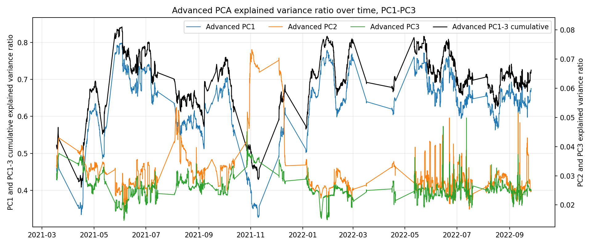

# PCA Residual Stat-Arb Mainline

This report is the cleaned mainline narrative. It excludes the discarded EVR timing, exact-MLE OU, and robust/winsorized OU explorations. The retained story is:

1. build PCA residuals with a no-lookahead rolling universe;
2. model residual mean reversion with OU / AR(1) s-scores;
3. verify signal strength with naive 1-dollar positions;
4. convert the signal to an ordinary PCA, equal-weight dollar-neutral baseline;
5. improve the residual construction with advanced PCA and control factor exposure with a portfolio optimizer.

## 1. Data And No-Lookahead PCA

At each hourly timestamp `t`, the PCA uses only the previous 360 hourly returns `[t-360h, t-1h]`. A ticker is eligible for PCA only if it is in the no-lookahead universe and has a complete rolling window. This keeps the factor construction dynamic and avoids using future data availability.

The ordinary PCA baseline removes PC1-PC3 from standardized returns. PC1 behaves like the broad crypto market factor; PC2 and PC3 capture smaller relative structures.


## 2. OU Residual Modeling

Each residual return series is accumulated into a residual level path and fit with an AR(1) transition:

```text
X[t+1] = a + b X[t] + eps[t]
```

The OU parameters are implied by the AR(1) fit:

```text
kappa = -log(b)
half_life = log(2) / kappa
mu = a / (1 - b)
s_score = (X[t] - mu) / sigma_eq
```

The final filter set is intentionally simple:

- finite price, return, and s-score;
- valid mean reversion, enforced by the OU estimator through `0 < b < 1`;
- `0 < half_life <= 90h`;
- no sigma percentile entry filter;
- no R2 entry filter;
- no half-life bucket-specific entry threshold optimization.

This keeps the mainline focused on residual construction rather than parameter-heavy signal filtering.


## 3. Naive 1-Dollar Position Layer

Before portfolio construction, the naive layer opens a fixed 1-dollar position for each signal. This is not the final portfolio; it is a signal diagnostic. It confirms that the residual s-score stream has directional content, while also showing that unconstrained 1-dollar position stacking creates uncontrolled exposure.


## 4. Ordinary PCA Baseline: Equal-Weight Dollar Neutral

The ordinary PCA mainline baseline uses matched sleeves. When both long and short candidates exist, the engine opens a dollar-neutral sleeve with equal-weight long and short allocations. There is no portfolio optimizer in the ordinary baseline.

This baseline is deliberately plain:

- ordinary PCA residuals;
- equal long and short notional at sleeve entry;
- gross cap `2.5`;
- fixed thresholds: long entry/exit `1 / 0.5`, short entry/exit `1 / 0.25`;
- `half_life <= 90h`;
- force exit when a ticker leaves the no-lookahead universe.

At 5bps, the ordinary equal-weight baseline produces positive but weak performance:

| method | fee_bps | final_net_equity | max_drawdown_net | sharpe_like_net | positions | sleeves |
|:--|--:|--:|--:|--:|--:|--:|
| ordinary equal-weight | 5 | 1.4295 | -1.1939 | 0.7970 | 8165 | 2545 |

## 5. Advanced PCA

The advanced PCA change happens at the residual construction stage. Instead of ranking factors only by explained variance, the PCA basis is optimized to penalize residual comovement:

```text
objective = reconstruction_loss + lambda_pca_comovement * residual_PC1_EVR_corr
```

The selected mainline setting is:

- `lambda_pca_comovement = 0.5`;
- PC1-PC3 residual construction;
- same dynamic eligible universe as ordinary PCA;
- same OU and signal filters as the ordinary baseline.

Advanced PCA keeps the economic interpretation clean: the strategy improves because the residuals are cleaner, not because more signal filters are added.



## 6. Portfolio Optimizer

Advanced PCA uses the same sleeve engine, but adds a soft factor-exposure optimizer at entry. The optimizer stays close to equal weights while penalizing z-scored beta exposure:

```text
minimize distance_to_equal_weight + lambda_portfolio_zbeta * z_beta_exposure^2
```

The selected mainline setting is:

- ordinary baseline: no optimizer, equal-weight dollar-neutral;
- advanced PCA: soft factor optimizer with `lambda_portfolio_zbeta = 3.0`;
- long and short notional remain equal at sleeve entry;
- existing positions are not continuously rebalanced.


## 7. Mainline Performance

The converged comparison at 5bps:

| method | PCA | portfolio | fee_bps | final_net_equity | max_drawdown_net | sharpe_like_net | avg_active_gross_exposure | positions | sleeves |
|:--|:--|:--|--:|--:|--:|--:|--:|--:|--:|
| ordinary | ordinary PC1-PC3 | equal-weight dollar neutral | 5 | 1.4295 | -1.1939 | 0.7970 | 2.2858 | 8165 | 2545 |
| advanced | residual-comovement-penalized PCA, `lambda_pca_comovement = 0.5` | soft factor optimizer, `lambda_portfolio_zbeta = 3.0` | 5 | 4.7158 | -0.6293 | 2.9666 | 2.2201 | 4609 | 1718 |

All accounting checks pass:

| check | ordinary | advanced |
|:--|:--|:--|
| final equity reconciliation | pass | pass |
| short sign validation | pass | pass |

The result supports the main conclusion: the strongest improvement comes from cleaner PCA residual construction plus controlled portfolio-level factor exposure. The mainline does not rely on sigma stop loss, R2 filtering, exact OU MLE, robust OU replacement, or EVR timing gates.

## 8. Retained Diagnostics

The retained diagnostics are used to explain the strategy rather than add more fitted rules:

- PCA EVR and loadings show the factor structure.
- OU examples show why mean-reverting residual quality matters.
- Naive 1-dollar positions show signal content before portfolio construction.
- Dollar-neutral and optimizer comparisons show how exposure control changes the realized equity curve.


## 9. Caveats

- Same-close execution is optimistic.
- Hourly data cannot validate intrabar fills.
- Bid-ask spread, slippage, market impact, borrow, and funding costs are not fully modeled.
- The strategy still needs walk-forward / out-of-sample validation.
- The advanced PCA optimizer adds computation cost, so production usage should persist PCA metadata and monitor optimizer convergence.

## 10. Reproducibility

Run the full retained pipeline:

```bash
python scripts/final_pipeline/run_final_pipeline.py
```

Key retained outputs:

- `reports/final_report/converged_mainline/converged_summary.csv`
- `reports/final_report/converged_mainline/converged_validation.csv`
- `reports/final_report/converged_mainline/converged_mainline_report.md`
- `reports/final_report/advanced_pca_v1/advanced_pca_v1_diagnostics_report.md`
- `reports/final_report/mainline_narrative.md`
